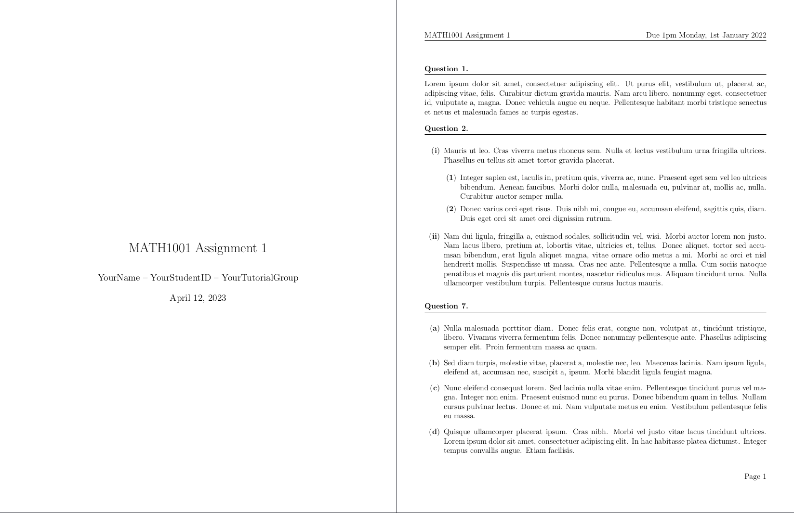

---

<h3 align="center">TeX Templates</h3>

This repo is a collection of my custom LaTeX templates.

- [assignment-template](/assignment-template/) (package): A template for assignments and homework sets.
- [cheatsheet-template](/cheatsheet-template/) (preamble): A template for cheatsheets.
- [limao-preamble](/limao-preamble/): A general preamble with commonly-used packages imported and some helpful macros defined. I don't have too many macros defined, since I prefer to use snippets (found [here](https://github.com/LimaoC/dotfiles/blob/main/nvim/.config/nvim/lua/snippets/tex.lua)).

## Installation

Follow the steps below to install the templates in this repository.

1. Clone the repository to some local directory:
    ```
    git clone git@github.com:LimaoC/TeX-templates
    ```
2. Create symlinks for each template you'd like in your TeX home directory. Your TeX home directory can be found using the following command:
    ```
    kpsewhich -var-value=TEXMFHOME
    ```
    For linux users, this will usually be `~/texmf/`. If the path to the cloned repository is `path/TeX-templates`, you'd create your symlinks like so:
    ```
    mkdir -p ~/texmf/tex/latex
    ln -s path/TeX-templates/assignment-template ~/texmf/tex/latex/assignment-template
    ln -s path/TeX-templates/cheatsheet-template ~/texmf/tex/latex/cheatsheet-template
    ln -s path/TeX-templates/limao-preamble ~/texmf/tex/latex/limao-preamble
    ```
    For more information about installing LaTeX packages this way, see https://en.wikibooks.org/wiki/LaTeX/Installing_Extra_Packages.

Storing the templates in your TeX home directory lets you conveniently import them from anywhere on your machine with
```tex
\usepackage{assignment-texplate}  % for the package templates
\input{cheatsheet-preamble}       % for the cheatsheet preamble
\input{limao-preamble}            % for the general preamble file
```

## Usage

See the `README.md`'s in each respective template's directory.

## License
(MIT License) See [LICENSE](https://github.com/LimaoC/assignment-texplate/blob/main/LICENSE).

