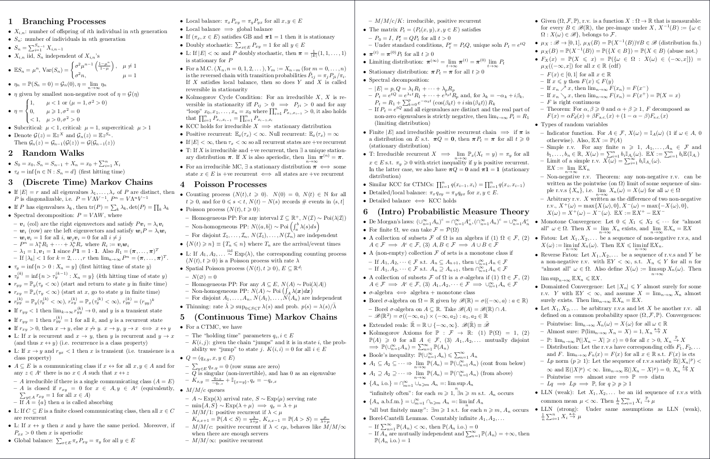

# Cheatsheet TeXplate

## Usage

**NOTE: Make sure you've followed the installation instructions in the repo's main README.md ([here](../README.md)).**

The template preamble is in `preamble.tex` and contains all the page formatting options, some included packages etc. `empty.tex` is a fresh file that just imports `preamble.tex`.

See the `example.tex` file for an example usage of the template.

